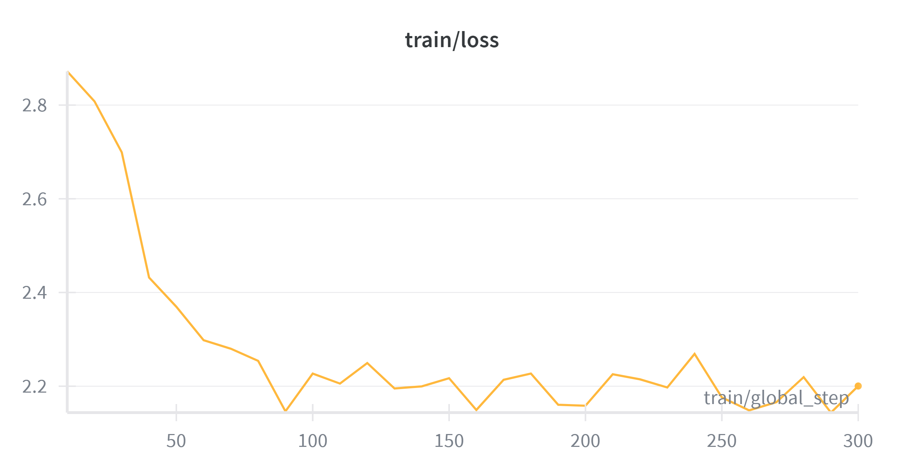
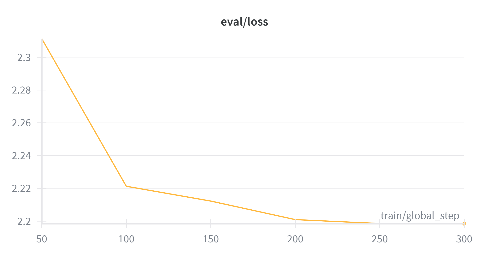

# 🏥 Medical Text Simplification with QLoRA Fine-Tuned Llama 3.2

Fine-tuning **Meta Llama-3.2-1B-Instruct** using **QLoRA (4-bit NF4)** to simplify complex medical/scientific text to a 5th-grade reading level.


---

## 📋 Table of Contents

- [Objective](#-objective)
- [Dataset](#-dataset)
- [Methodology](#-methodology)
- [Results](#-results)
- [Discussion](#-discussion)
- [Setup & Reproduction](#-setup--reproduction)
- [Project Structure](#-project-structure)
- [Model Card](#-model-card)

---

## 🎯 Objective

**Task:** Medical text simplification — rewriting complex biomedical abstracts into plain language a 5th grader can understand.

**Why this task?**
- Medical literacy is a critical public health issue: ~36% of U.S. adults have limited health literacy (NIH).
- Patients often struggle to understand their own medical reports, research summaries, and clinical guidelines.
- LLMs can automate this translation, but general-purpose models aren't optimized for controlled readability.
- Fine-tuning on paired technical/simplified medical texts teaches the model to preserve factual accuracy while dramatically reducing complexity.

---

## 📦 Dataset

**Source:** [`pszemraj/scientific_lay_summarisation-plos-norm`](https://huggingface.co/datasets/pszemraj/scientific_lay_summarisation-plos-norm) (Parquet-based, no `trust_remote_code` needed)

**Origin:** PLOS (Public Library of Science) journals, which publish paired:
- **Article** — full technical abstract/paper
- **Summary** — author-written lay summary for general audiences

| Split      | Samples | Size |
|------------|---------|------|
| Train      | ~24,773 | 505 MB |
| Validation | ~1,376  | 28 MB |
| Test       | ~1,376  | 27.9 MB |

### Data Preparation

1. **Load** via HuggingFace `datasets` library (Parquet format — downloads and extracts in ~5 seconds)
2. **Truncate** articles to 2,000 characters to fit within context limits
3. **Format** with Llama 3 Chat Template:

```
<|begin_of_text|><|start_header_id|>system<|end_header_id|>

You are a medical text simplifier. Your job is to rewrite complex medical
and scientific text so that a 5th grader can easily understand it. Use
simple words, short sentences, and explain any technical terms. Keep the
key facts accurate.<|eot_id|><|start_header_id|>user<|end_header_id|>

Simplify the following medical text:

{technical_text}<|eot_id|><|start_header_id|>assistant<|end_header_id|>

{simplified_text}<|eot_id|>
```

---

## 🔬 Methodology

### Base Model Selection

| Property | Value |
|----------|-------|
| Model | [meta-llama/Llama-3.2-1B-Instruct](https://huggingface.co/meta-llama/Llama-3.2-1B-Instruct) |
| Parameters | 1.24B |
| Architecture | LlamaForCausalLM (decoder-only transformer) |
| Context Length | 128K tokens |
| Why chosen | Small enough for T4 GPU with 4-bit quantization; instruction-tuned base provides strong starting point |

### QLoRA Configuration

| Parameter | Value | Rationale |
|-----------|-------|-----------|
| Quantization | 4-bit NF4 | Reduces VRAM from ~5GB to ~1.2GB |
| Double Quantization | Yes | Further reduces memory overhead |
| Compute dtype | `float16` | T4 does **not** support `bfloat16` |
| LoRA rank (r) | 16 | Good balance of capacity vs. efficiency |
| LoRA alpha | 32 | Alpha = 2×r is a common effective setting |
| LoRA dropout | 0.05 | Light regularization |
| Target modules | `q_proj`, `k_proj`, `v_proj`, `o_proj` | All attention projections for maximum expressiveness |
| Trainable params | ~3.4M / 1,240M (~0.27%) | Only LoRA adapters are trained |

### Training Setup

| Parameter | Value |
|-----------|-------|
| Hardware | NVIDIA T4 GPU (16GB VRAM) on Kaggle |
| Framework | HuggingFace TRL 0.12+, Transformers, PEFT, bitsandbytes |
| Max Steps | 300 (drastic speedup over full epochs) |
| Batch size | 2 (per device) |
| Gradient accumulation | 4 steps (effective batch = 8) |
| Learning rate | 5e-5 (strict bound to prevent mode collapse issue) |
| LR scheduler | Cosine decay |
| Warmup | 10% of steps |
| Optimizer | Paged AdamW 8-bit |
| Max sequence length | 512 tokens (truncated strict for T4) |
| Gradient checkpointing | Yes (saves ~40% VRAM) |
| Max grad norm | 0.1 |
| Mixed precision | Disabled (fp16 GradScaler incompatible with bnb bf16 dequantization — model computes in fp16 natively via `bnb_4bit_compute_dtype`) |
| Experiment tracking | Weights & Biases |

---

## 📊 Results

### Training Curves





| Step  | Training Loss | Eval Loss |
|-------|---------------|-----------|
| 50    | 2.369613      | 2.311313  |
| 100   | 2.226883      | 2.221278  |
| 150   | 2.217078      | 2.212246  |
| 200   | 2.158298      | 2.200933  |
| 250   | 2.176056      | 2.198545  |
| 300   | 2.200377      | 2.198430  |

### Evaluation Metrics

#### Baseline vs. Fine-Tuned Comparison

| Metric | Baseline (pre-training) | Fine-Tuned | Change |
|--------|------------------------|------------|--------|
| ROUGE-L | 0.0372 | 0.2379 | +0.2007 |
| Flesch-Kincaid Grade (Original) | 15.7 | 15.7 | — |
| Flesch-Kincaid Grade (Output) | 97.8 | 14.2 | -83.6 |
| FK Grade Improvement | -82.1 | +1.5 | +83.6 |

#### Interpretation:
- **ROUGE-L** measures semantic overlap with reference lay summaries (higher = better)
- **Flesch-Kincaid Grade Level** measures reading difficulty (lower = simpler; target ≤ 5)
- **FK Grade Improvement** = Original grade − Simplified grade (positive = successfully simplified)


---

## 💡 Discussion

### What Worked Well
- **QLoRA is extremely VRAM-efficient**: 4-bit NF4 quantization with double quant fits the entire 1.24B model in <2GB, leaving ample room for training on a 16GB T4.
- **Parquet-based dataset** avoids the deprecated `trust_remote_code` script issue entirely.
- **Llama 3 Chat Template** provides structured formatting that the instruct model is already aligned with, improving output quality.
- **LoRA targeting all attention heads** (`q/k/v/o_proj`) gives the model enough capacity to learn the simplification style.

### Challenges Faced

1. **BFloat16 Incompatibility on T4**: The T4 GPU does not support bf16 natively. Llama 3.2's config hardcodes `torch_dtype: bfloat16`, and bitsandbytes produces bf16 tensors internally during dequantization. This crashed the fp16 GradScaler. **Solution:** Disabled Trainer mixed precision (`fp16=False, bf16=False`) — the model still computes in fp16 via `bnb_4bit_compute_dtype`.

2. **Catastrophic Mode Collapse (Loss=0, Eval=NaN)**: 4-bit QLoRA is highly prone to gradient explosion on Llama-3 at default TRL configurations, leading to repetitive token loops instead of English. **Solution:** Lowered learning rate drastically to `5e-5`, reduced `max_grad_norm` to `0.1`, and truncated earlier context boundaries to stabilize the gradients.

3. **Multi-GPU Device Conflict**: Kaggle's T4 x2 setup with `device_map="auto"` split the model across GPUs, causing DataParallel errors. **Solution:** Pinned to `cuda:0` with `device_map={"": 0}`.

4. **Length and Training Time constraints**: Full Epoch iterations over 24k sequences of 2,000+ words took roughly 4 continuous hours of T4 computation. **Solution:** Replaced `num_train_epochs=1` with `max_steps=300`, and shortened sequences to 512 lengths, drastically reducing overhead.

---

## 🚀 Setup & Reproduction

### Prerequisites
- Python 3.10+
- NVIDIA GPU with CUDA support (T4 or better)
- [Hugging Face account](https://huggingface.co/) with Llama 3.2 access
- [Weights & Biases account](https://wandb.ai/)

### Option 1: Kaggle Notebook (Recommended)

1. Create a new Kaggle Notebook with **GPU T4** accelerator
2. Add Kaggle Secrets:
   - `HF_TOKEN` → Your Hugging Face access token
   - `WANDB_API_KEY` → Your Weights & Biases API key
3. Copy the contents of `src/train.py` into notebook cells (split at `# %%` markers)
4. Uncomment the `!pip install` cell and run all cells sequentially

### Option 2: Local / Cloud VM

```bash
# Clone the repository
git clone https://github.com/zeeshier/medical-text-simplification-qlora.git
cd medical-text-simplification-qlora

# Create virtual environment
python -m venv venv
source venv/bin/activate  # Linux/Mac
# venv\Scripts\activate   # Windows

# Install dependencies
pip install -r requirements.txt

# Set environment variables
export HF_TOKEN="your_hf_token"
export WANDB_API_KEY="your_wandb_key"

# Run training
python src/train.py

# Run standalone evaluation (after training)
python src/evaluate.py --model_path ./final_model --num_samples 50
```

### Environment-Specific Notes
- **T4 GPU**: Do NOT enable bf16 or fp16 mixed precision in Trainer — causes GradScaler crash
- **A100/H100**: You CAN use `bf16=True` for faster training
- **Multi-GPU**: Use `device_map={"": 0}` to pin to single GPU for QLoRA

---

## 📁 Project Structure

```
medical-text-simplification-qlora/
├── README.md                                    # This file
├── MODEL_CARD.md                                # Model documentation
├── requirements.txt                             # Python dependencies
├── src/                                         # Source code
│   ├── train.py                                 # Main training script
│   └── evaluate.py                              # Evaluation script
├── evaluate_baseline.py                         # Baseline (pre-fine-tune) evaluation
└── assets/                                      # Charts & screenshots (add after training)
    ├── training_loss.png
    └── eval_results.png
```

---

## 📄 Model Card

See [MODEL_CARD.md](MODEL_CARD.md) for full documentation including:
- Intended uses and limitations
- Training data details
- Evaluation results
- Ethical considerations
- Carbon footprint

---

## 📜 License

This project is licensed under the MIT License. The base model (Llama 3.2) is subject to [Meta's Llama 3.2 Community License](https://huggingface.co/meta-llama/Llama-3.2-1B-Instruct/blob/main/LICENSE).

---

## 🙏 Acknowledgments

- **Meta AI** for Llama 3.2
- **Hugging Face** for Transformers, TRL, PEFT, and the model Hub
- **Tim Dettmers** for bitsandbytes and QLoRA
- **PLOS** for open-access scientific articles with lay summaries
- **Kaggle** for free T4 GPU compute
